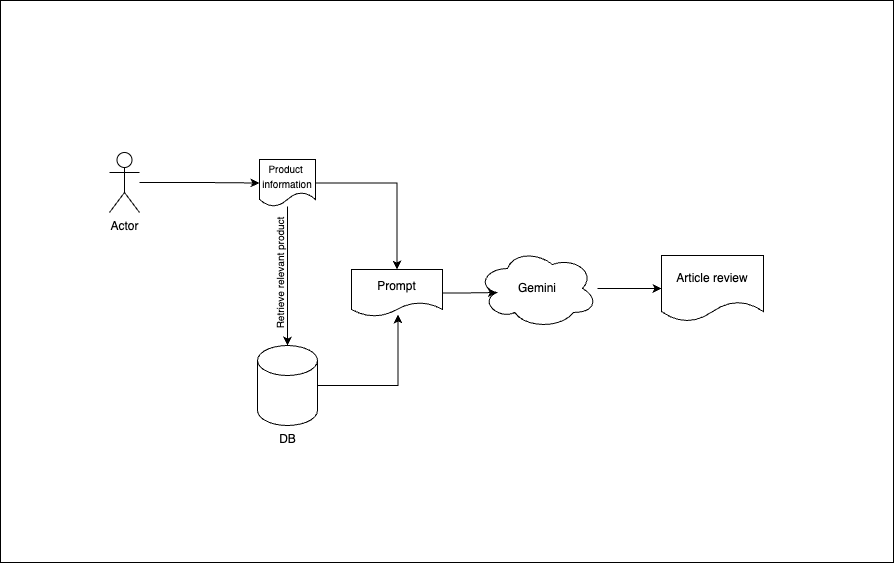

*Readme only for websosanh branch*

# Pipeline

[]

# Data Store Elastic
```json
"properties": {
    "id": {
        "type": "keyword"
    },
    "url": {
        "type":"text"
    },
    "domain": {
        "type":"text"
    },
    "title": {
        "type": "text"
    },
    "description": {
        "type": "text"
    },
    "content": {
        "type": "text"
    },
    "insertDate": {
        "type": "date",
        "format": "yyyy-MM-dd HH:mm:ss"
    },
    "article_type":{
        "type": "text"
    }
}
```